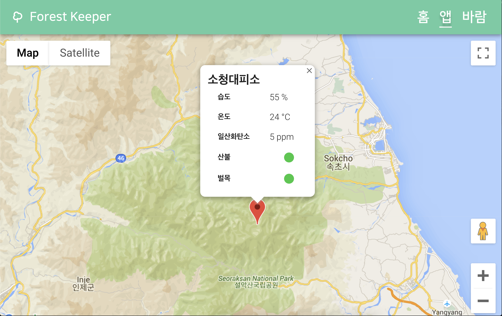

# ForestKeeper

1. [**소개**](#소개)
2. [**기술 스택**](#기술-스택)
3. [**기능 소개**](#기능-소개)
4. [**구경하기**](#구경하기)
5. [**설치하기**](#설치하기)
6. [**개발하기**](#개발하기)
7. [**빌드하기**](#빌드하기)
8. [**기여하기**](#기여하기)

## 소개

> 불법 벌목과 산불로부터 숲을 지키기 위한 솔루션

> 선린인터넷등학교 IoT 아이디어 경진대회 금상 수상작

- [Documentation](https://drive.google.com/file/d/1Cmtl7lnE9Xwg4NzIdW4B2jZsBRW7s8xU/preview)

## 기술 스택

**Front-end**

## 기능 소개

- **앱**: ThingSpeak API에서 IoT 디바이스의 정보와 상태를 가져와 Google Map에 표시
- **바람**: 바람 상태 확인

## 구경하기

- [https://forestkeeper.web.app](https://forestkeeper.web.app)

## 설치하기

- `npm i`

## 개발하기

- `npm run serve`

## 빌드하기

- `npm build`

## 기여하기

- [Issues](https://github.com/heptacode/forestkeeper/issues)
